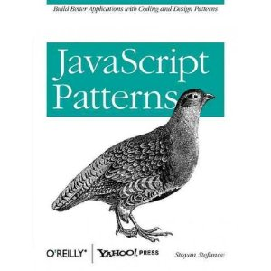

!SLIDE

# JavaScript Patterns

!SLIDE bullets incremental

# Types of Patterns

* Design patterns
* Coding patterns
* Anti-patterns

.notes - GoF, mostly studed from strongly-typed C++ perspective
 JS specific patterns, unique to JS (main topic)
 Common approach causing more problems than it solves

!SLIDE bullets incremental

# JS Basics

* Object-oriented
* First-class functions
* Dynamically typed

.notes - everything's an object (except null, undefined)
 functions are objects
 variables don't have types, modify objects at runtime

!SLIDE bullets incremental

# JS Basics

* Native vs. Host objects
* No classes
* Prototype

.notes - native objects defined by ECMAScript standard (Number, String), JS is
  based on ECMAScript
  host defined by the environment (window)
  constructor functions simulate classes
  every function has a prototype property, an object, that is used to simulate
  inheritance
